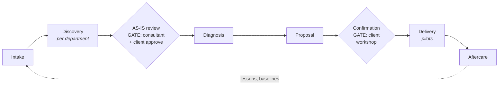

# Consultant guides — start here

You are looking at the Roadmap Engine: a system that turns per-department
discovery at a client (workshop transcripts, notes, intake) into two
interactive deliverables — an **AS-IS review** the client approves as a
faithful picture of how they work today, and a **roadmap proposal** the client
operates and confirms (scored opportunities, adjustable € assumptions, waves).
The repository gives you three things in every stage: **templates** (never a
blank page), **agents and skills** (the AI does the mechanical work, you make
the judgment calls), and **mechanical checks** (`check_engagement.py` tells
you when a stage is actually done). These guides explain each stage in plain
language; the binding spec for every data contract, enum, and gate is
[`../README.md`](../README.md) — when in doubt, that file wins.

## The pipeline



Each stage gates the next; never skip a gate to save time. The two decision
gates belong to humans: only you set `Status: approved` on AS-IS content, and
only the client's workshop confirmation moves an engagement to `confirmed`.

| Stage (`engagements.csv`) | Guide | Client workspace folders |
|---|---|---|
| `intake` | [`01-intake.md`](01-intake.md) | `engagement-config.json` · `intake/` · `client-context.md` |
| `discovery` | [`02-discovery.md`](02-discovery.md) | `departments/NN-<dept>/` (briefings, inputs, pains, content, coverage) |
| `asis-review` | [`03-asis-review.md`](03-asis-review.md) | `departments/NN-<dept>/flows/` · `asis/output/` |
| `diagnosis` | [`04-diagnosis.md`](04-diagnosis.md) | `analysis/` |
| `proposal` → `confirmed` | [`05-proposal.md`](05-proposal.md) | `proposal/` |
| `delivery` → `aftercare` → `closed` | [`06-delivery-aftercare.md`](06-delivery-aftercare.md) | per-pilot charters · `07-roadmap-engine/baselines/` |

Two commands you will use in every stage, from the repo root:

```bash
python3 07-roadmap-engine/tools/check_engagement.py 03-clients/<slug>   # is this stage done and consistent?
python3 07-roadmap-engine/tools/build_asis.py 03-clients/<slug>         # rebuild the AS-IS deliverable
```

Guides are consultant-side and in English; every client deliverable follows
the `language` in `engagement-config.json` (Belgian default: `nl`).

## Glossary — the jargon, once

| Term | Meaning |
|---|---|
| **AS-IS** | how a process runs *today* — documented per catalog process, rendered as clickable BPMN flows color-coded by pain severity |
| **PAIN-x** | one discrete pain point with a literal client quote, source citation, type, severity, and volume — numbered once across the whole engagement |
| **OPP-x** | one opportunity in the register: allocation, F3 scores, value formula, verdict, first step |
| **HAA** | Human/Automation/Agent allocation (F4): who or what should do a task — `human`, `automation`, `agent`, or `hybrid` |
| **Agent tier T1–T3** | agent autonomy (F4): T1 drafts, human decides every item · T2 acts, human reviews samples/exceptions · T3 autonomous, humans audit metrics. Every agent starts at T1 and earns promotion |
| **Quadrant** | position on the F3 Value × Feasibility plot: **quick win** (high/high), **big bet** (high value, low feasibility), **fill-in** (low value, high feasibility), **discard** — the verdict must match the computed quadrant ("high" = ≥ 3.5) |
| **Wave** | delivery batch on the roadmap: `1`, `2`, `3` (or `-` for discards) |
| **Gate** | a stop where a human must approve before the next stage may start — enforced mechanically by the tools |
| **Directive** | one consultant instruction attached to a gate ("split SAL.030 into two flows") that must be resolved and checked off before the gate can be approved |
| **Assumption / slider** | one calibratable number in `analysis/assumptions.json` (4–8 per engagement); every € figure in the proposal derives from these via stated formulas, and the client can adjust them live |
| **Catalog process code** | `<PREFIX>.<NNN>` (e.g. `SAL.030`) — a coded generic business process from `../catalog/departments.json`, the controlled vocabulary everything maps to |
| **engagement-config** | `engagement-config.json` at the client workspace root: client name, slug, language, sector, departments in scope, day rate |
| **F1** | AI maturity scan — where the organisation stands today |
| **F2** | AI strategy & value pools — where value hides, business-case discipline |
| **F3** | use-case prioritization — Value × Feasibility scoring, quadrants, waves |
| **F4** | operating model & org design — HAA allocation and agent tiers |
| **F5** | change management — adoption, identity, co-building |
| **F6** | governance, risk & EU AI Act — human oversight, deployer duties |

## Where things live

- **Binding spec** (contracts, enums, gates, cost model): [`../README.md`](../README.md)
- **Frameworks F1–F6**: [`../../01-frameworks/`](../../01-frameworks/) — cite them by path in every deliverable that applies them
- **Catalog** (departments, process codes, patterns): [`../catalog/`](../catalog/)
- **Standard flows** to adapt per client: [`../flows/`](../flows/)
- **Tools**: [`../tools/`](../tools/) — `build_asis.py`, `build_proposal.py`, `check_engagement.py`
- **Effort baselines** (recalibrated at every close): [`../baselines/effort-baselines.json`](../baselines/effort-baselines.json)
- **Client workspaces**: [`../../03-clients/`](../../03-clients/) — `engagements.csv` is the single source of truth for stage; `_template/` is the blank workspace; `_demo-installtech/` is a complete worked example
- **Skills that do the heavy lifting**: `/analyze-department` (steps 0a–4), `/build-roadmap-proposal` (steps 5–6), `/run-engagement` (the whole pipeline) — in [`../../.claude/skills/`](../../.claude/skills/)
- **Delivery playbooks** (pilots, change, scale): [`../../02-phase-playbooks/`](../../02-phase-playbooks/)
